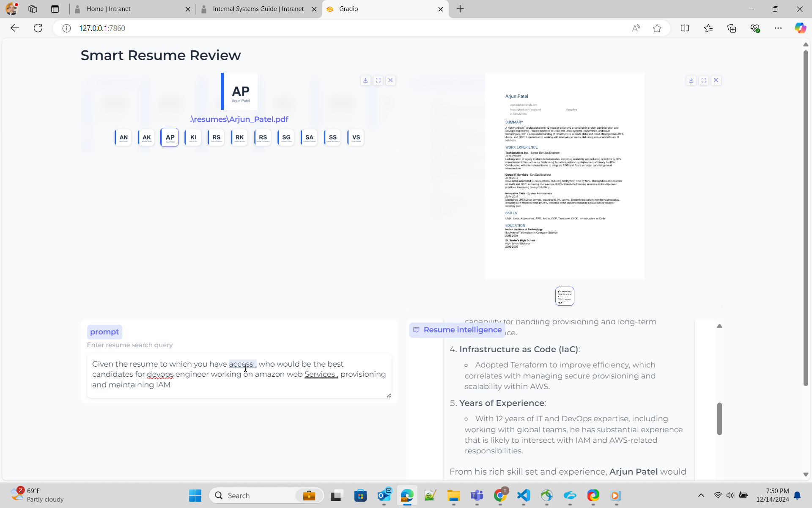

# resume search intelligence
Resume search using natural queries .  Demo application using openai RAG api and opensource VLM model to do resume comparative analysis.  
This would help talent partners and engineering managers to get specific information from the resume.

## Objective 
Objective of resume intelligence would be to support natural language query on a set of resumes .
It can be used to do comparative analysis of resumes .
Let us say , that we have 4 or 5 resumes of prospective software engineers
Some of the query , which it should allow you to fire are 
1. Does any of the candidates have team management experience ? 
2. Who has more experience in java and docker in set of resumes ?

## Synthetic generation of resume
  In this experiment , you need resumes.  
  Instead of searching for data from internet , i have used chagpt api to generate a resume .  
  I used openai function call and structured response output to get json output.   
  Once you have json , you can convert it into pdf resume document.  

```
   OPENAI_KEY=<substitute your key>
``` 
```bash
   # Install python packages locally.
   pip install -r requirements.txt
   python ui_show_resume.py
```

## How to run 
  This example can be run on local windows machine/laptop. 
  It does not have special requirement in terms of GPU 
  You need to select 2 resumes from UI application , type in the query in prompt box.  
  and hit submit.  
  User needs to key in openai key in .env file which is present in root of the folder.    
  .env file example

```
   OPENAI_KEY= <openai key>
   vector_store_resume=resume_compare
   MODEL=gpt-4o-2024-11-20
   # individual file is put into vector store if value is FALSE
   CONCAT_PDF=False
   # instruction for assistant is chosen based on this. Possible values ( individual_pdf|concat_pdf)
   INSTRUCTION_ID=individual_pdf
   # Path where generated pdf resumes are stored.
   RESUME_PATH=.\\resumes

``` 
```bash
   python ui_resume_compare2.py
```
## User interface


## Approaches
Here i use RAG approaches 
1. RAG - with openai
   openai has assistant api , which has option of storing the vector representation of document and searching against the same .
   Refer here for documentation [File Search](https://platform.openai.com/docs/assistants/tools/file-search)
   On how to use file search api , i referred simon wilson's excellent [blog](https://simonwillison.net/2024/Aug/30/openai-file-search/) and gist he made [sample code](https://gist.github.com/simonw/97e29b86540fcc627da4984daf5b7f9f)

2. RAG - with opensource colpali
   This is approach of using VLM . I plan to use Byaldi which internally uses colpali
   Refer to notebook , which has sample code [chat with pdf using byaldi
   ](https://github.com/AnswerDotAI/byaldi/blob/main/examples/chat_with_your_pdf.ipynb)
   I am yet to implement this.

## Using openai file search 
This is a straightforward approach .I use openai apis to create a vector store and add all pdf documents to vector store . post that create a assistant and attach vector store to assistant 

### concatenation of files - not required
openai file search , seems to be not working well in earlier experiments, for queries which is touching multiple documents . Initial solution seems to be concatenate the files and upload in vector store . However this was incorrect understanding on how to present instructions to model 

To improve the response , it advertently means that , instructions or system prompt has to be adjusted so that , you get correct results . Here is mine and i am imploring the model to do correct search .

```
You are dilligent assistant specializing in analyzing resume for technology industry . Your goal is to find the a individual resume closely matched per the requirement from user
1. ** location of resume ** - Vector store has resume of individual candidates . Name of the vector store is resume_compare .
2  ** format of resume ** - Vector store has resume of individual candidates in pdf format. Name of the pdf would be firstname followed by underscore last name . E.g Rajesh_Kumar.pdf
3  ** vector store** - Vector store resume_compare belongs to the user/owner, whose is calling the api 
4  ** role descriptions** - For job role description such as engineering manager , devops engineer , software engineer , use your knowledge based gained from pre-training. 
5  ** Resume Search Strategy** - Search across ALL documents in vector store .Consider partial matches across multiple documents .Use multiple search queries for different aspects (skills, experience, etc.) 
6  ** Search Depth ** - Perform multiple searches with varied keywords. Use both exact and semantic matching.
7  ** Result Aggregation ** - Combine result from multiple searches . Cross-reference finding across documents. 
8  ** key qualitifications ** - For finding key qualifications or experiences for role/work , use your knowledge base and pre-training. 
9  ** resume search** - For Candidates's resume and their capability ,skills , experience for a role/work , you must use file_search tool and attached vector store. Resume will always be present in vector store.
10  ** resume presence** - Resume will always present in vector store attached to assistant . Do not prompt to ask user on resume.
11  ** Dillgence ** - Please search dilligently . you seem to miss the fact that resume files are present in vectore store resume_compare.
12  ** Technical Skills** -  In the resume take a deep look at work experience section .Focus on relevant programming languages, frameworks, tools, and certifications (e.g., Python, Java, AWS, Docker). Highlight these clearly.
13.  ** Job Match** - Compare the resume with provided job descriptions. Focus on matching key technologies ,business and opetational knowledge and job experience, and note areas where the candidate doesn’t meet the requirements.
14.  ** Projects & Experience** - Prioritize large-scale projects or leadership roles in tech teams. Identify open-source contributions or significant technical achievements.
```

